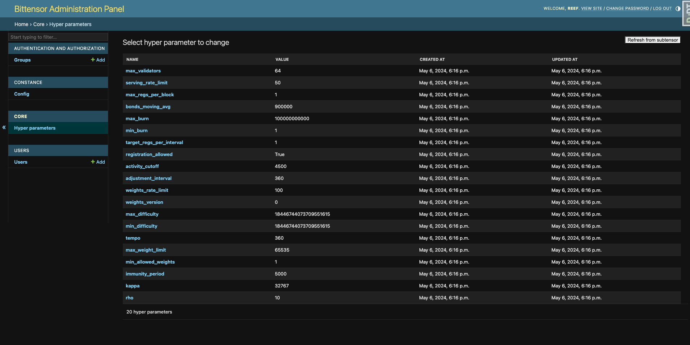

# bittensor-panel

Bittensor admin panel



Web application allowing you to easily manage your bittensor subnet's hyperparameters.

# Installation

## Requirements

- docker with [compose plugin](https://docs.docker.com/compose/install/linux/)
- python 3.11
- [pdm](https://pdm-project.org)

## Setup

```sh
$ ./setup-dev.sh
docker compose up -d
```

Open `.env` file in the project root and set required environment variables:
- SUBTENSOR_ADDRESS
- SUBNET_UID
- WALLET_NAME
- WALLET_PATH

Apply database migrations:

```sh
cd app/src
pdm run manage.py wait_for_database --timeout 10
pdm run manage.py migrate
```

Create a superuser to access the admin panel:

```sh
pdm run manage.py createsuperuser
```

## Starting the application

```sh
cd app/src
pdm run manage.py runserver
```
Your application should now be available at `http://localhost:8000`.

# Usage

## Loading data from the subnet

To load all hyperparameters from the subtensor on first start (or in case you would like to overwrite local data for some reason), click "Refresh from subtensor" button in the top right corner.

## Modyfing hyperparameters

Find the hyperparameter you would like to change and click on it. You will be presented with a form allowing you to change the value of the hyperparameter. After you are done, click "Save" to save the changes. This will update the hyperparameter in the local database and send the new value to the subtensor.

```sh
